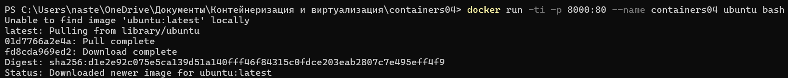
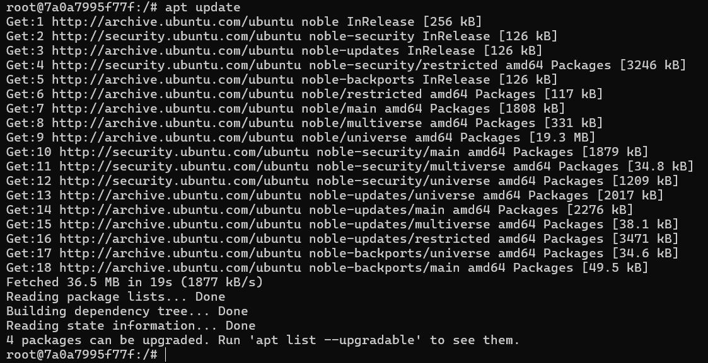
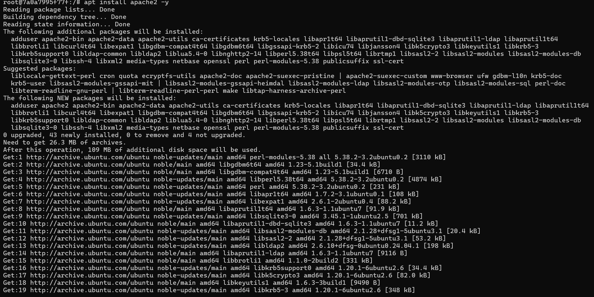
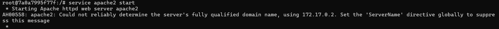
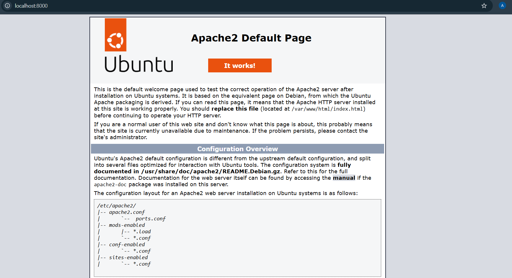
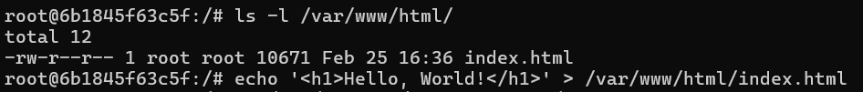
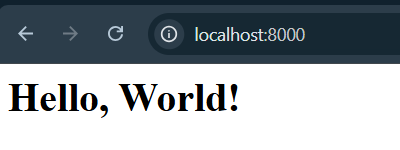
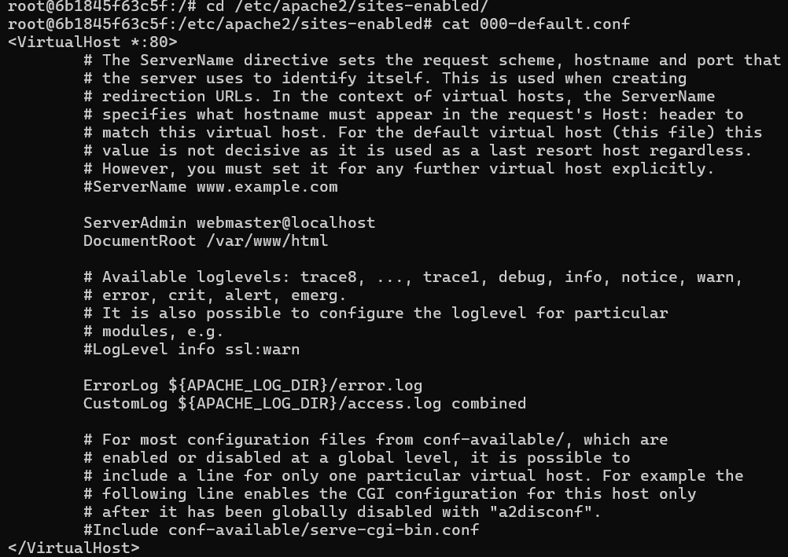
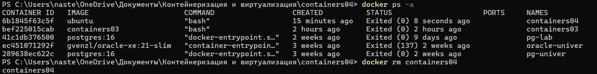

# Лабораторная работа №4:  Использование контейнеров как среды выполнения

**Каварналы Анастасия, IA2403** 

**Дата:** 25.02.2026

## Цель работы:

Вспомнить основные команды ОС Debian/Ubuntu, а также работа позволяет познакомиться с Docker и его основными командами.

## Задание

Запустить контейнер Ubuntu, установить Web-сервер Apache и вывести в браузере страницу с текстом "Hello, World!"

## Подготовка

Для выполнения работы требуется установленный **Docker** (Docker Desktop на Windows)

## Ход работы
### 1) Создан репозиторий `containers04` и склонировала его себе на компьютер

```powershell
git clone https://github.com/CavarnaliA/containers04
cd containers04
```
### 2) Запуск контейнера Ubuntu с пробросом порта

```powershell
docker run -ti -p 8000:80 --name containers04 ubuntu bash
```



### 3) Обновление списка пакетов
(внутри контейнера, где `root@...:/#`)

```bash
apt update
```



### 4) Установка Apache
(внутри контейнера)

```bash
apt install apache2 -y
```



### 5) Запуск Apache
(внутри контейнера)

```bash
service apache2 start
```



### 6) Проверка в браузере

Открыла в браузере:

`http://localhost:8000`

**Что видно:**

Стандартная страница Apache по умолчанию (Apache2 Ubuntu Default Page).
Это означает, что Apache работает и порт проброшен правильно.



### 7) Просмотр файлов веб-папки и замена страницы на "Hello, World!"
(внутри контейнера)

```bash
ls -l /var/www/html/
echo '<h1>Hello, World!</h1>' > /var/www/html/index.html
```

**Результат:**

После обновления страницы в браузере отображается:
`Hello, World!`




### 8) Просмотр конфигурации сайта Apache
(внутри контейнера)

```bash
cd /etc/apache2/sites-enabled/
cat 000-default.conf
```



### 9) Выход из контейнера
(внутри контейнера)

```bash
exit
```

**Результат:**

- Выход из контейнера в PowerShell

- Контейнер останавливается (потому что завершилась команда bash)

### 10) Просмотр контейнеров и удаление контейнера
(в PowerShell, где PS C:\...>)

```powershell
docker ps -a
docker rm containers04
```

**Результат:**

Контейнер удалён, в списке `docker ps -a` его больше нет



## Описание команд 

1. Скачивает (копирует) репозиторий с GitHub на компьютер

```powershell
git clone https://github.com/CavarnaliA/containers04
```

2. Создаёт и запускает контейнер Ubuntu и открывает внутри него терминал.
Порт делает так, чтобы сайт из контейнера был доступен на компьютере по `http://localhost:8000`

```powershell
docker run -ti -p 8000:80 --name containers04 ubuntu bash
```

3. Обновляет список программ, которые можно установить 

```bash
apt update
```

4. Устанавливает веб-сервер Apache. `-y` означает “согласиться автоматически”

```bash 
apt install apache2 -y
```

5. Запускает Apache, чтобы он начал отдавать страницы в браузер

```bash
service apache2 start
```

6. Показывает, какие файлы лежат в папке сайта (где находится главная страница)

```bash
ls -l /var/www/html/
```

7. Записывает текст “Hello, World!” в файл index.html (то есть меняет главную страницу сайта)

```bash
echo '<h1>Hello, World!</h1>' > /var/www/html/index.html
```

`>` означает “перезаписать файл”

8. Переходит в папку, где лежат включённые настройки сайтов Apache

```bash
cd /etc/apache2/sites-enabled/
```

9. Показывает содержимое файла настроек сайта по умолчанию 

```bash
cat 000-default.conf
```

10. Показывает список всех контейнеров (и запущенных, и остановленных)

```powershell
doсker ps -a
```

11. Удаляет контейнер с именем containers04

```powershell
docker rm containers04
```

## Вывод

В ходе лабораторной работы был запущен контейнер Ubuntu в Docker и выполнены базовые команды Debian/Ubuntu. В контейнере установлен и запущен веб-сервер Apache, проверена его доступность через `http://localhost:8000`, а также заменена страница по умолчанию на страницу с текстом `"Hello, World!"`. После завершения работы выполнен выход из контейнера, просмотрены все контейнеры и контейнер `containers04` был удалён

## Библиография

1. Docker Docs — команда `docker run` (запуск контейнера, параметры `-p`, `--name`, интерактивный режим)  
   [https://docs.docker.com/reference/cli/docker/container/run/](https://docs.docker.com/reference/cli/docker/container/run/)
2. Docker Docs — команда `docker ps` / `docker container ls` (просмотр контейнеров, включая `-a`)  
   [https://docs.docker.com/reference/cli/docker/container/ls/](https://docs.docker.com/reference/cli/docker/container/ls/)
3. Docker Docs — команда `docker rm` / `docker container rm` (удаление контейнера)  
   [https://docs.docker.com/reference/cli/docker/container/rm/](https://docs.docker.com/reference/cli/docker/container/rm/)
4. Ubuntu Tutorial — установка и настройка Apache  
   [https://ubuntu.com/tutorials/install-and-configure-apache](https://ubuntu.com/tutorials/install-and-configure-apache)
5. Ubuntu Server Docs — управление пакетами (APT)  
   [https://documentation.ubuntu.com/server/how-to/software/package-management/](https://documentation.ubuntu.com/server/how-to/software/package-management/)
6. Apache HTTP Server Documentation — директива `DocumentRoot` (откуда Apache отдаёт сайт)  
   [https://httpd.apache.org/docs/current/mod/core.html](https://httpd.apache.org/docs/current/mod/core.html)
7. ChatGPT  
   [https://chatgpt.com/](https://chatgpt.com/)
